# StockAgent

개인용 스윙 투자 의사결정 보조 도구다. 자동매매가 아니라 Python 기반 정량 스크리닝과 LLM 기반 차트/뉴스 해석을 결합해 근거 중심 후보를 정리한다. 현재는 `discovery universe + dynamic watchlist` 방향으로 확장 중이다.

## 핵심 원칙

- 정량 계산은 Python에서 수행
- 차트 해석과 뉴스 해석은 LLM agent가 수행
- agent 간 자유 대화 없이 `orchestrator`가 순차 호출
- 모든 종목 동일 포맷 유지
- 후보 없음/관찰만 허용
- 최신 뉴스만 사용
- 매 실행 결과 JSON 저장
- 서비스가 종목을 발굴하고 watchlist를 유지/제거할 수 있게 확장

## 디렉터리 구조

```text
repo/
  app/
    main.py
    config.py
    orchestrator.py
    models/schemas.py
    models/enums.py
    data/universe.py
    data/market_data.py
    data/news_data.py
    data/watchlist.py
    data/sector_data.py
    screening/screener.py
    screening/filters.py
    chart/features.py
    chart/indicators.py
    chart/patterns.py
    agents/llm_client.py
    agents/chart_agent.py
    agents/news_agent.py
    agents/final_agent.py
    agents/macro_agent.py
    evaluation/tracker.py
    evaluation/performance.py
    evaluation/backtest_stub.py
    reporting/formatter.py
    reporting/telegram.py
    reporting/storage.py
    portfolio/sizing_stub.py
  data/outputs/
  data/logs/
  data/performance/
  requirements.txt
  README.md
  .github/workflows/stock_scan.yml
```

## 시스템 다이어그램



Mermaid 원본: [docs/system-diagram.mmd](/Users/young/PycharmProjects/StockAgent/docs/system-diagram.mmd)

## 환경변수

- `LLM_PROVIDER` 선택사항, `openai|anthropic|gemini`, 기본값 `openai`
- `LLM_MODEL_DEFAULT` 선택사항, 공통 기본 모델
- `LLM_MODEL_CHART` 선택사항, Chart Agent 모델
- `LLM_MODEL_NEWS` 선택사항, News Agent 모델
- `LLM_MODEL_FINAL` 선택사항, Final Agent 모델
- `LLM_MODEL_MACRO` 선택사항, Macro Agent 모델 placeholder
- `OPENAI_API_KEY`
- `ANTHROPIC_API_KEY`
- `GOOGLE_API_KEY`
- `TELEGRAM_BOT_TOKEN`
- `TELEGRAM_CHAT_ID`
- `STOCK_UNIVERSE` 선택사항, 예: `AAPL,MSFT,NVDA`
- `US_STOCK_UNIVERSE` 선택사항, 미장 discovery pool
- `KR_STOCK_UNIVERSE` 선택사항, 국장 discovery pool
- `UNIVERSE_MODE` 선택사항, `discovery_plus_watchlist|watchlist|manual`, 기본값 `discovery_plus_watchlist`
- `INCLUDE_WATCHLIST` 선택사항, 기본값 `true`
- `WATCHLIST_PATH` 선택사항, 기본값 `data/outputs/watchlist.json`
- `WATCHLIST_MAX_WEAK_RUNS` 선택사항, 기본값 `3`
- `MAX_NEWS_AGE_HOURS` 선택사항, 기본값 `72`
- `TOP_N_CANDIDATES` 선택사항, 기본값 `5`
- `CANDIDATE_MIN_FINAL_SCORE` 선택사항, 기본값 `72`
- `OBSERVE_MIN_FINAL_SCORE` 선택사항, 기본값 `55`
- `CANDIDATE_MIN_CHART_SCORE` 선택사항, 기본값 `68`
- `CANDIDATE_MIN_NEWS_SCORE` 선택사항, 기본값 `45`

## 로컬 실행

```bash
python -m venv .venv
source .venv/bin/activate
pip install -r requirements.txt
python -m app.main --no-telegram
```

설정과 의존성만 점검하려면:

```bash
python -m app.main --self-check
```

실제 스캔을 일부 종목으로 제한하려면:

```bash
python -m app.main --no-telegram --limit 2
```

선택한 provider의 structured JSON 응답을 최소 단위로 확인하려면:

```bash
python -m app.main --llm-smoke
```

역할별 모델 smoke test를 보려면:

```bash
python -m app.main --llm-smoke --llm-role final
```

Telegram 연결만 테스트하려면:

```bash
python -m app.main --telegram-test
```

## GitHub Actions

`.github/workflows/stock_scan.yml`는 다음 트리거를 지원한다.

- `workflow_dispatch`
- `schedule`

GitHub Secrets에 아래 값을 설정한다.

- `OPENAI_API_KEY`
- `ANTHROPIC_API_KEY`
- `GOOGLE_API_KEY`
- `TELEGRAM_BOT_TOKEN`
- `TELEGRAM_CHAT_ID`

GitHub Variables 또는 환경변수로 아래 값을 설정할 수 있다.

- `LLM_PROVIDER`
- `LLM_MODEL_DEFAULT`
- `LLM_MODEL_CHART`
- `LLM_MODEL_NEWS`
- `LLM_MODEL_FINAL`
- `LLM_MODEL_MACRO`

## 저장 결과

매 실행마다 `data/outputs/scan_YYYYMMDD_HHMMSS.json`과 `data/outputs/latest.json`을 저장한다. watchlist를 켜면 `data/outputs/watchlist.json`도 함께 갱신한다.

필수 필드:

- `run_at`
- `candidate_count`
- `ticker`
- `name`
- `chart_features`
- `chart_analysis`
- `news_analysis`
- `final_analysis`

## 샘플 결과 JSON

샘플 파일: [data/outputs/sample_result.json](/Users/young/PycharmProjects/StockAgent/data/outputs/sample_result.json)

## 샘플 Telegram 메시지

```text
[2026-04-10 23:30 KST] Swing Scan

NVDA | NVIDIA
- 종합 점수: 78 | 상태: candidate
- 차트 근거: Price is holding above MA20 and MA60. / Price is within reach of the 20-day high with supportive volume. / Recent volatility has tightened versus the prior month.
- 뉴스 요약: NVIDIA headlines show continued AI demand focus / Recent coverage mentions growth-type positive catalysts.
- 주요 리스크: Recent price run-up raises chase risk. / Check whether fresh news changes the near-term thesis.
- 무효화 기준: Setup weakens if price loses the nearby support zone. Hint: 20d low 842.15, MA20 875.42, MA60 812.90.
```

## 후보 없음 예시

```text
[2026-04-10 23:30 KST] 후보 없음

스크리닝과 최종 판단을 통과한 종목이 없습니다.
```

## 구현 메모

- 시세 데이터는 `yfinance`를 사용한다.
- 뉴스는 Google News RSS를 사용해 최신성 필터를 적용한다.
- discovery universe는 현재 `US/KR curated symbol pool`로 시작하며, 실행 중 유효한 종목은 watchlist에 자동 편입/유지될 수 있다.
- watchlist는 `candidate/observe/avoid` 결과를 바탕으로 자동 갱신되며, 약한 결과가 누적되면 비활성화된다.
- 국장 지원은 ticker와 watchlist 구조까지 먼저 열어둔 상태이며, 시장 커버리지와 뉴스 품질은 이후 보강 대상이다.
- LLM 호출은 provider adapter 패턴으로 추상화했고 `OpenAI`, `Anthropic`, `Gemini`를 지원한다.
- 모델 선택은 provider 공통 구조를 사용하고, `default/chart/news/final/macro` 역할별 모델 오버라이드를 지원한다.
- OpenAI 기본 조합은 `chart/news/default = gpt-4.1-mini`, `final = gpt-4.1`이다.
- provider structured JSON 호출 실패 시 deterministic fallback을 둔다.
- fallback이 발생하면 결과 필드 안에 fallback 사용 흔적을 남긴다.
- 후보 없음과 관찰만은 실제 `action_label` 기준으로 분리하며, 관찰 종목이 있으면 Telegram에 상위 관찰 종목 요약을 함께 보낸다.
- 민감정보는 코드나 로그에 출력하지 않는다.

## 현재 한계

- 미장/국장 universe는 아직 외부 지수 소스에서 자동 동기화하지 않고 curated symbol list 기반이다.
- 뉴스는 ticker 중심 Google News RSS라 국장 종목에서 정밀도가 떨어질 수 있다.
- watchlist 운영은 기본 상태 관리까지만 구현되어 있고, discovery와 tracking 기준의 세밀한 분리는 다음 단계다.
